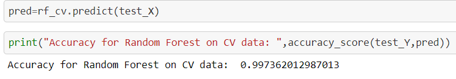
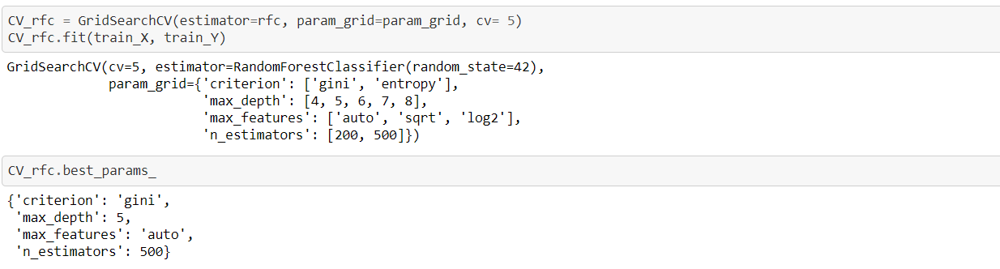
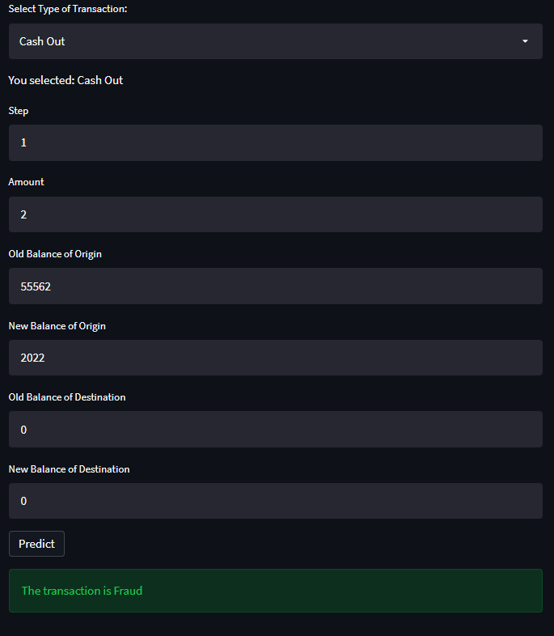
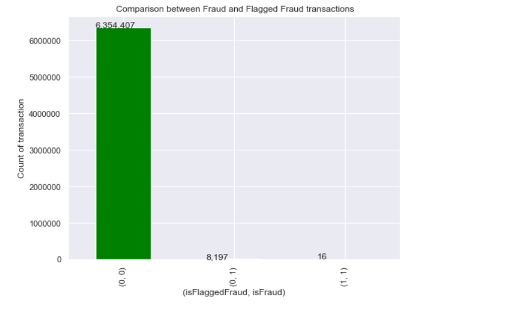
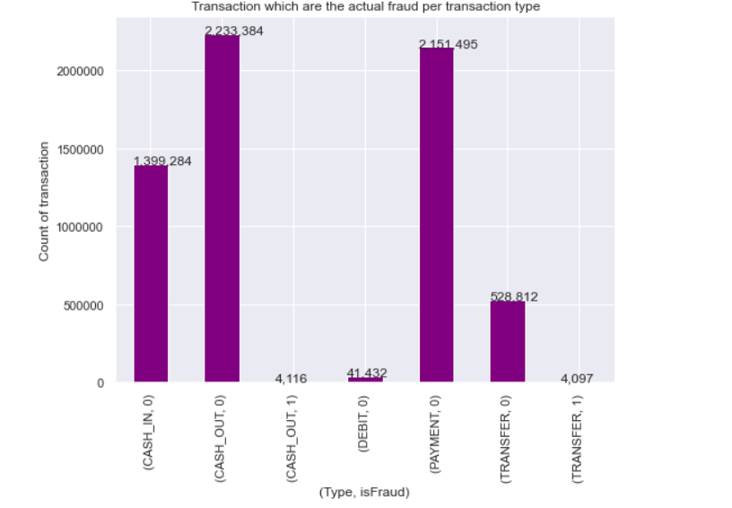
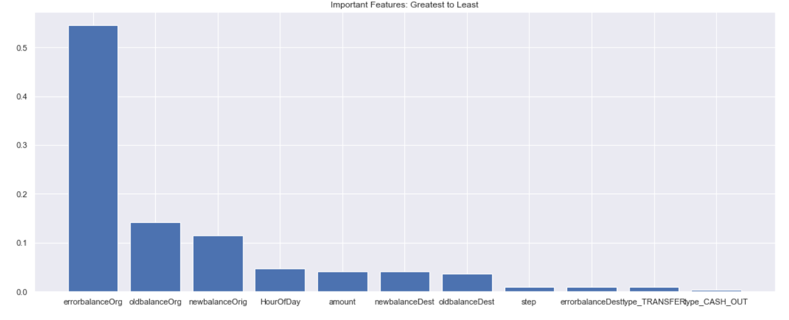

# Credit Card Fraud Detection System

An end to end Data Science project on Credit Card fraud detection system using machine learning algorithms

-[ML App Link](https://creditcardfrauddetectionpp.herokuapp.com/#credit-card-fraud-detection)

## Acknowledgements

 - [Kaggle Dataset](https://www.kaggle.com/ealaxi/paysim1)
 
## Key Points

- ML application that predicts if the transaction is fraud
- Used Supervised learning in form of Random Forest for the purpose 
- Cross Validation Accuracy score over 0.997362  
- Used Grid Search CV to find the best parameters

  
## Notes

PaySim simulates mobile money transactions based on a sample of real transactions extracted from one month of financial logs from a mobile money service implemented in an African country. The original logs were provided by a multinational company, who is the provider of the mobile financial service which is currently running in more than 14 countries all around the world.

# Conclusion
1. The dataset is huge with over million data points, and the ratio of fraud to valid data is heavily skewed towads valid data.

2. Feature engineering and creation of two new features namely 'errorbalance' and 'HourofDay' yielded fruitful results.

3. I used undersampling as I have huge data and undersampling the majority call won't effect the data.

4. The models I worked on are Decision Tree, K-Nearest Neighbors (KNN), Logistic Regression, AdaBoost Classifier, Random Forest, and XGBoost

5. The best model was Random Forest Classifier and performed GridSearchCV to determine the best parameters.

6. The biggest problem is faced was handling the overfitting. Choosing between the resampling techniques both Oversampling and undersampling was a bit of a challenge. Finally I selected RandomUnderSampling as it did not show overfitted results. 

7. Working with such a large dataset is always a challenge and this helped me learn a lot .
  
## Screenshots

  

## Feedback

If you have any feedback, please reach out to me at pritampaul360@gmail.com
